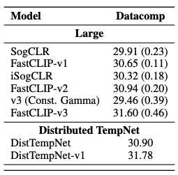
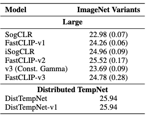
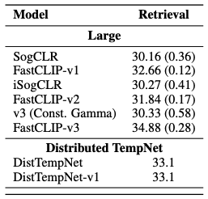

## Requirements
- python 3.9
- torch 1.10
- torchvision 0.11 
- timm 0.5.4
- transformers 4.11.0
- open-clip-torch 2.31.0
- webdataset 0.2.31

Please install a new environment in your server using the provided environment.yml file


## Credits
Our implementation is based on [ALBEF](https://github.com/salesforce/ALBEF). <br />
It is an extension of original TempNet paper accepted at ICML 24 (https://arxiv.org/abs/2404.04575). <br />
We also thank mlfoundations (OpenCLIP) for providing implementation of Vision Transformer.

## 📚 Citation

If you find this work or code helpful, please consider citing this paper:

```bibtex
@article{qiu2024to,
  title     = {To Cool or not to Cool? Temperature Network Meets Large Foundation Models via DRO},
  author    = {Zi-Hao Qiu and Siqi Guo and Mao Xu and Tuo Zhao and Lijun Zhang and Tianbao Yang},
  journal   = {arXiv preprint arXiv:2404.04575},
  year      = {2024}
}
```


## Data
These bimodal experiments on TempNet and its distributed training framework need three image-text datasets: CC3M ([download](https://ai.google.com/research/ConceptualCaptions/download)), CC12M ([download](https://github.com/google-research-datasets/conceptual-12m)), and DFN ([download](https://machinelearning.apple.com/research/data-filtering-networks)). Besides, one also needs the following files to build pytorch datasets,  [clip_train](https://drive.google.com/drive/folders/1hAd0956xIztfwq0WrWLTGBx8sNuye595?usp=sharing) and [downstream](https://drive.google.com/drive/folders/1hAd0956xIztfwq0WrWLTGBx8sNuye595?usp=sharing), for pretraining and downstream tasks, respectively.

## Evaluation Dataset
We used Datacomp(1B) ([download](https://github.com/mlfoundations/datacomp)) to evaluate which includes 38 zero-shot downstream tasks. We also report the average performance on two
subsets of the tasks: ImageNet and its different variants (IN & Variants), and Retrieval. IN & Variants tasks consist of ImageNet-1k and 6 ImageNet distribution shift datasets. Retrieval tasks consist of Flickr30k, MSCOCO, and WinoGAViL.

After downloading the data, one needs to organize the data folder as follows: <br />
For CC3M:
```
.
+--cc3m
|  +--cc3m_train
|  +--cc3m_valid
|
+--coco
|  +--train2014
|  +--val2014
|  +--test2015
|
+--flickr30k
|  +--flickr30k_images
|
+--clip_train 
|
+--downstream
```
For CC12M:
```
/cc12m/00000.tar
/cc12m/00001.tar
...
/cc12m/01242.tar
```

For DFN Med (12M/2B):
```
/DFN/00000000.tar
/DFN/00001.tar
...
/DFN/00001926.tar
```
## Distributed TempNet (DistTempNet)

The implementation of **DistTempNet** and its associated loss function can be found in [`models/losses.py`](models/losses.py).

We extend **TempNet** to support **large-scale distributed training**, optimized for multi-node and multi-GPU environments. Our setup uses:

- **8 A100 on 4 compute nodes**
- **48 CPUs total**
- Dataset: **CC12M and DFN 12M**
This configuration achieves **~45 minutes per epoch** on the full CC12M dataset.

## CLIP Architecture Exploration

We explored multiple CLIP-style encoder combinations:

- **ViT-B/32 + Text Transformer**, both trained **from scratch**
  - Text transformer uses **Byte Pair Encoding (BPE)** for tokenization
- **ResNet-50** and **DistilBERT**, using **pretrained checkpoints**
  - DistilBERT uses HuggingFace's **`AutoTokenizer`** for consistent text tokenization


## 🚀 V1 (Cosine decay on γ): We call V1 as the version of DistTempNet with this scheduling

In **DistTempNet v1**, we introduce **cosine scheduling** on the parameter γ (`gamma`) to gradually reduce the variance between stochastic gradient estimator and U (`U`) in the compositional optimization problem, which improves final model performance as epochs increase.


## Training
```bash
#SBATCH --job-name=TempNetTraining            # Set the job name to "TempNetTraining"
#SBATCH --time=40:00:00                        # Set the wall clock limit to 30 hours
#SBATCH --ntasks=8                           # Request 8 tasks (for distributed training)
#SBATCH --ntasks-per-node=2                    # Request 8 tasks per node
#SBATCH --cpus-per-task=6
#SBATCH --mem=80G                              # Request 80GB of memory
#SBATCH --output=/path/to/output/ViTb32.%j  # Send stdout/err to "TempNetOut.[jobID]"
#SBATCH --gres=gpu:a100:2                    # Request 8 A100 GPUs (2 per node)
#SBATCH --partition=gpu                         # Specify the partition for GPU jobs

# Set environment variables
export TRANSFORMERS_OFFLINE=1
data_path=/path/to/your/data/cc12m # Base data path 
imagenet_val_path=/path/to/your/data/imagenet/val # Updated ImageNet path
train_image_root=/path/to/your/data/cc12m # New CC3M train path  
data=cc12m
val_coco_file=/path/to/your/data/coco_val.json  # Add this line for the validation file
lr=0.0008
frac=1.0
desc=isogclr_tempnet
gamma=0.8
rho=9.5

# Change to the directory containing your script
cd /working/directory
master_addr=$(scontrol show hostnames "$SLURM_JOB_NODELIST" | head -n 1)
export MASTER_ADDR=$master_addr
export MASTER_PORT=4820


# Run your training script with the appropriate parameters
srun python -u  clip_cc12m.py \
    --train-data '/path/to/your/data/cc12m/{00000..01242}.tar' \
    --train-num-samples 9184307 --data_size 12423374 \
    --dataset_type webdataset\
    --data_path ${data_path} \
    --data ${data} \
    --train_file ${train_file} \
    --train_image_root ${train_image_root} \
    --val_coco_file ${val_coco_file} \
    --output_dir output/TempNet_ViT_${data}_gamma${gamma}_rho${rho}_${desc} \
    --use_amp \
    --init_model \
    --image_encoder ViT \
    --text_encoder Transformer \
    --epochs 33 --lr ${lr} \
    --lr_temp_net 3e-5 \
    --rho ${rho} \
    --train_frac ${frac} \
    --zs_dataset imagenet \
    --zs_datafolder ${imagenet_val_path} \
    --ita_type isogclr_tempnet \
    --batch_size_train 512 \
    --world_size 8 \
    --distributed True \
    --warmup_epochs 20 \
    --workers 2 \
    --seed 2024 \
    --image_res 224 \
    --sogclr_gamma ${gamma} \
    --embed_dim 512
```


## Evaluation on Datacomp, ImageNet Variants and Retrieval
```bash
#!/bin/bash

##NECESSARY JOB SPECIFICATIONS  
#SBATCH --job-name=Evaluation     
#SBATCH --time=10:00:00                        
#SBATCH --ntasks=1                          
#SBATCH --ntasks-per-node=1                   
#SBATCH --cpus-per-task=6
#SBATCH --mem=80G                              
#SBATCH --output=/path/to/your/data/datacomp/Evaluation.%j 
#SBATCH --gres=gpu:a100:1                   
#SBATCH --partition=gpu                     

cd /working/directory/
python evaluate.py \
 --train_output_dir /path/to/your/data/datacomp/train_output_dir \
 --data_dir /path/to/your/data/datacomp_datasets \
 --model ViT-B-32 \
 --use_model "ViT-B-32 /path/to/your/checkpoint/checkpoint.pth"

```
## Results (Evaluation - Trained on CC12M (large)):

#### Datacomp: Measuring the average zero-shot performance across 38 diverse downstream tasks 

 <br />

#### ImageNet Variants: Measuring robustness using ImageNet-1k and six of its distribution-shifted variants 

 <br />

#### Retrievals: Measuring the model's ability to perform image-text retrieval tasks like Flickr30k, MSCOCO, and WinoGAViL




